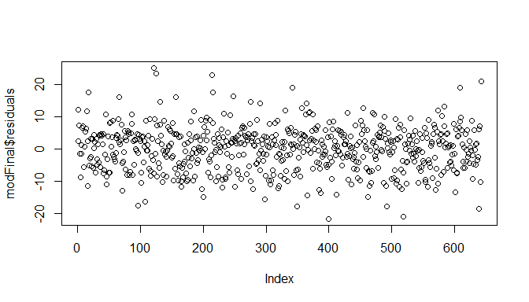

## Setup

### Load packages


```r
library(ggplot2)
library(dplyr)
library(statsr)
```

### Load data


```r
load("movies.Rdata")
```


* * *

## Part 1: Data
The dataset contains information on 651 movies released before 2016. The data is randomly selected but not randomly assigned. Hence,any information or conlcusion derived from this project can be generalized but can't be used to determine causality. 

* * *

## Part 2: Research question

To find out what attributes are an integral contributor ti the popularity (audience score) of a movie and to predict the popularity if a movie from some given attributes .

* * *

## Part 3: Exploratory data analysis

Refining the dataset to the required attributes only.


```r
df<-movies

df2<-df%>%select(title_type,genre,runtime,mpaa_rating,studio,thtr_rel_month,thtr_rel_day,imdb_rating,imdb_num_votes,critics_rating,critics_score,audience_rating,audience_score,best_actor_win)

str(df2)
```

```
## Classes 'tbl_df', 'tbl' and 'data.frame':	651 obs. of  14 variables:
##  $ title_type     : Factor w/ 3 levels "Documentary",..: 2 2 2 2 2 1 2 2 1 2 ...
##  $ genre          : Factor w/ 11 levels "Action & Adventure",..: 6 6 4 6 7 5 6 6 5 6 ...
##  $ runtime        : num  80 101 84 139 90 78 142 93 88 119 ...
##  $ mpaa_rating    : Factor w/ 6 levels "G","NC-17","PG",..: 5 4 5 3 5 6 4 5 6 6 ...
##  $ studio         : Factor w/ 211 levels "20th Century Fox",..: 91 202 167 34 13 163 147 118 88 84 ...
##  $ thtr_rel_month : num  4 3 8 10 9 1 1 11 9 3 ...
##  $ thtr_rel_day   : num  19 14 21 1 10 15 1 8 7 2 ...
##  $ imdb_rating    : num  5.5 7.3 7.6 7.2 5.1 7.8 7.2 5.5 7.5 6.6 ...
##  $ imdb_num_votes : int  899 12285 22381 35096 2386 333 5016 2272 880 12496 ...
##  $ critics_rating : Factor w/ 3 levels "Certified Fresh",..: 3 1 1 1 3 2 3 3 2 1 ...
##  $ critics_score  : num  45 96 91 80 33 91 57 17 90 83 ...
##  $ audience_rating: Factor w/ 2 levels "Spilled","Upright": 2 2 2 2 1 2 2 1 2 2 ...
##  $ audience_score : num  73 81 91 76 27 86 76 47 89 66 ...
##  $ best_actor_win : Factor w/ 2 levels "no","yes": 1 1 1 2 1 1 1 2 1 1 ...
```

Telling whther a movie was popular or not after it has been selected(or awarded) for an oscar award seems pointless since it would be obvious that one would like to predict the movie's popularity beforehand.


Checking for null(missing) values


```r
library(Amelia)
```

```
## Loading required package: Rcpp
```

```
## ## 
## ## Amelia II: Multiple Imputation
## ## (Version 1.7.5, built: 2018-05-07)
## ## Copyright (C) 2005-2018 James Honaker, Gary King and Matthew Blackwell
## ## Refer to http://gking.harvard.edu/amelia/ for more information
## ##
```

```r
missmap(df2,main = "missing values",col = c('yellow','black'),legend = F,y.at = c(1),y.labels = c(''))
```

```
## Warning in if (class(obj) == "amelia") {: the condition has length > 1 and
## only the first element will be used
```

```
## Warning: Unknown or uninitialised column: 'arguments'.

## Warning: Unknown or uninitialised column: 'arguments'.
```

<!-- -->

```r
df2<-df2 %>% filter(!is.na(df2$studio)) 
df2<-df2 %>% filter(!is.na(df2$runtime))
missmap(df2,main = "missing values",col = c('yellow','black'),legend = F,y.at = c(1),y.labels = c(''))
```

```
## Warning in if (class(obj) == "amelia") {: the condition has length > 1 and
## only the first element will be used
```

```
## Warning: Unknown or uninitialised column: 'arguments'.

## Warning: Unknown or uninitialised column: 'arguments'.
```

<!-- -->


Let's check the relationship between the explanatory (numerical variables) and the response variable

```r
ggplot(df2,aes(x=runtime,y=audience_score))+geom_point(color='blue',alpha=0.5)+stat_smooth(method="lm",se=F)
```

<!-- -->

There does'nt seem to be a good linear relationship between these 2 variables.


```r
ggplot(df2,aes(x=thtr_rel_month,y=audience_score))+geom_point(alpha=0.5)+stat_smooth(method="lm",se=F) +geom_jitter()
```

<!-- -->
The distribution seems to be completely random and rel_month might not prove out to be a good predictor.


```r
ggplot(df2,aes(x=thtr_rel_day ,y=audience_score))+geom_point(alpha=0.5)+stat_smooth(method="lm",se=F) + geom_jitter()
```

<!-- -->
This also seems to have no relation..


```r
ggplot(df2,aes(x=imdb_rating  ,y=audience_score))+geom_point(alpha=0.5)+stat_smooth(method="lm",se=F)
```

<!-- -->
There seems  to be a strong relation(positive) between the imdb rating and the audience ratings.
This is quite relatable to considering the quality with which imdb rates keeping everything in mind.


```r
ggplot(df2,aes(x=imdb_num_votes ,y=audience_score))+geom_point(alpha=0.5)+stat_smooth(method="lm",se=F)
```

<!-- -->
There seems to be a moderate relation between these 2  .

```r
ggplot(df2,aes(x=critics_score ,y=audience_score))+geom_point(alpha=0.5)+stat_smooth(method="lm",se=F)
```

<!-- -->
The critics score and the audience score also tend to have a moderaltely strong and positive correlation.


Let's have a look at the correlation coefficients of the explanatory variables


```r
library(corrgram)
library(corrplot)
```

```
## corrplot 0.84 loaded
```


```r
colnames(df2)
```

```
##  [1] "title_type"      "genre"           "runtime"        
##  [4] "mpaa_rating"     "studio"          "thtr_rel_month" 
##  [7] "thtr_rel_day"    "imdb_rating"     "imdb_num_votes" 
## [10] "critics_rating"  "critics_score"   "audience_rating"
## [13] "audience_score"  "best_actor_win"
```

```r
df2$imdb_num_votes<-as.numeric(df2$imdb_num_votes)
num.cols<-c(3,6,7,8,9,11)
cor.data<-cor(df2[,num.cols])

cor.data
```

```
##                   runtime thtr_rel_month thtr_rel_day imdb_rating
## runtime        1.00000000     0.22872736   0.04036424  0.26548090
## thtr_rel_month 0.22872736     1.00000000   0.11110281  0.07614532
## thtr_rel_day   0.04036424     0.11110281   1.00000000  0.02451732
## imdb_rating    0.26548090     0.07614532   0.02451732  1.00000000
## imdb_num_votes 0.34591529     0.10813129   0.06703439  0.33091223
## critics_score  0.16863665     0.03956064   0.02287787  0.76621251
##                imdb_num_votes critics_score
## runtime            0.34591529    0.16863665
## thtr_rel_month     0.10813129    0.03956064
## thtr_rel_day       0.06703439    0.02287787
## imdb_rating        0.33091223    0.76621251
## imdb_num_votes     1.00000000    0.20963797
## critics_score      0.20963797    1.00000000
```


```r
corrplot(cor.data,method = 'color')
```

<!-- -->
The critics score and imdb  rating are highly correlated which would cause collinearity.

Looking at the relationships, one thing is clear that theatre release month and date have almost no role in the prediction.
* * *

## Part 4: Modeling

Modeling technique to be used here is forward selection


```r
str(df2)
```

```
## Classes 'tbl_df', 'tbl' and 'data.frame':	642 obs. of  14 variables:
##  $ title_type     : Factor w/ 3 levels "Documentary",..: 2 2 2 2 2 1 2 2 1 2 ...
##  $ genre          : Factor w/ 11 levels "Action & Adventure",..: 6 6 4 6 7 5 6 6 5 6 ...
##  $ runtime        : num  80 101 84 139 90 78 142 93 88 119 ...
##  $ mpaa_rating    : Factor w/ 6 levels "G","NC-17","PG",..: 5 4 5 3 5 6 4 5 6 6 ...
##  $ studio         : Factor w/ 211 levels "20th Century Fox",..: 91 202 167 34 13 163 147 118 88 84 ...
##  $ thtr_rel_month : num  4 3 8 10 9 1 1 11 9 3 ...
##  $ thtr_rel_day   : num  19 14 21 1 10 15 1 8 7 2 ...
##  $ imdb_rating    : num  5.5 7.3 7.6 7.2 5.1 7.8 7.2 5.5 7.5 6.6 ...
##  $ imdb_num_votes : num  899 12285 22381 35096 2386 ...
##  $ critics_rating : Factor w/ 3 levels "Certified Fresh",..: 3 1 1 1 3 2 3 3 2 1 ...
##  $ critics_score  : num  45 96 91 80 33 91 57 17 90 83 ...
##  $ audience_rating: Factor w/ 2 levels "Spilled","Upright": 2 2 2 2 1 2 2 1 2 2 ...
##  $ audience_score : num  73 81 91 76 27 86 76 47 89 66 ...
##  $ best_actor_win : Factor w/ 2 levels "no","yes": 1 1 1 2 1 1 1 2 1 1 ...
```


```r
mod<-lm(formula = audience_score~genre,data=df2)
summary(mod)$adj.r.squared
```

```
## [1] 0.187043
```


```r
mod2<-lm(formula = audience_score~title_type,data=df2)
summary(mod2)$adj.r.squared
```

```
## [1] 0.09586927
```


```r
mod3<-lm(formula = audience_score~mpaa_rating,data=df2)
summary(mod3)$adj.r.squared
```

```
## [1] 0.06157184
```


```r
mod4<-lm(formula = audience_score~critics_rating,data=df2)
summary(mod4)$adj.r.squared
```

```
## [1] 0.3790109
```


```r
mod5<-lm(formula = audience_score~audience_rating,data=df2)
summary(mod5)$adj.r.squared
```

```
## [1] 0.7494235
```
from the numeric variables , the best option is to put the imdb ratings


```r
mod6<-lm(formula = audience_score~imdb_rating,data=df2)
summary(mod6)$adj.r.squared
```

```
## [1] 0.746987
```

Hence the first variable to put would be audience_rating.


```r
mod7<-lm(formula = audience_score~audience_rating+imdb_rating,data=df2)
summary(mod7)
```

```
## 
## Call:
## lm(formula = audience_score ~ audience_rating + imdb_rating, 
##     data = df2)
## 
## Residuals:
##      Min       1Q   Median       3Q      Max 
## -22.1451  -4.7216   0.6714   4.3825  24.1197 
## 
## Coefficients:
##                        Estimate Std. Error t value Pr(>|t|)    
## (Intercept)            -11.2698     2.0172  -5.587 3.43e-08 ***
## audience_ratingUpright  20.9966     0.7721  27.196  < 2e-16 ***
## imdb_rating              9.4724     0.3515  26.950  < 2e-16 ***
## ---
## Signif. codes:  0 '***' 0.001 '**' 0.01 '*' 0.05 '.' 0.1 ' ' 1
## 
## Residual standard error: 6.933 on 639 degrees of freedom
## Multiple R-squared:  0.8829,	Adjusted R-squared:  0.8825 
## F-statistic:  2409 on 2 and 639 DF,  p-value: < 2.2e-16
```
The adjusted R squared increased further by the addition of imdb_rating

Next what could possibly explain the  model more would be the critics rating but not to forget that the critics ratings and the imdb ratings were correlated to each other


```r
mod8<-lm(formula = audience_score~audience_rating+imdb_rating+critics_rating,data=df2)
summary(mod8)
```

```
## 
## Call:
## lm(formula = audience_score ~ audience_rating + imdb_rating + 
##     critics_rating, data = df2)
## 
## Residuals:
##      Min       1Q   Median       3Q      Max 
## -22.1114  -4.6863   0.7282   4.3662  23.9873 
## 
## Coefficients:
##                        Estimate Std. Error t value Pr(>|t|)    
## (Intercept)             -8.4274     2.6232  -3.213  0.00138 ** 
## audience_ratingUpright  20.7610     0.7845  26.463  < 2e-16 ***
## imdb_rating              9.1855     0.3897  23.568  < 2e-16 ***
## critics_ratingFresh     -0.4673     0.7856  -0.595  0.55212    
## critics_ratingRotten    -1.4704     0.9050  -1.625  0.10473    
## ---
## Signif. codes:  0 '***' 0.001 '**' 0.01 '*' 0.05 '.' 0.1 ' ' 1
## 
## Residual standard error: 6.928 on 637 degrees of freedom
## Multiple R-squared:  0.8834,	Adjusted R-squared:  0.8827 
## F-statistic:  1207 on 4 and 637 DF,  p-value: < 2.2e-16
```
We see that the  adjusted R squared did not increase considerably. Hence to  avoid redundant inforation we would drop critics_rating. Note that according to the model the critics_rating is not at all significant.


```r
mod9<-lm(formula = audience_score~audience_rating+imdb_rating+critics_score,data=df2)
summary(mod9)
```

```
## 
## Call:
## lm(formula = audience_score ~ audience_rating + imdb_rating + 
##     critics_score, data = df2)
## 
## Residuals:
##      Min       1Q   Median       3Q      Max 
## -21.6485  -4.6067   0.6473   4.3072  24.1852 
## 
## Coefficients:
##                        Estimate Std. Error t value Pr(>|t|)    
## (Intercept)            -9.72245    2.22720  -4.365 1.48e-05 ***
## audience_ratingUpright 20.83321    0.77755  26.793  < 2e-16 ***
## imdb_rating             9.03017    0.44371  20.351  < 2e-16 ***
## critics_score           0.02461    0.01510   1.629    0.104    
## ---
## Signif. codes:  0 '***' 0.001 '**' 0.01 '*' 0.05 '.' 0.1 ' ' 1
## 
## Residual standard error: 6.924 on 638 degrees of freedom
## Multiple R-squared:  0.8834,	Adjusted R-squared:  0.8828 
## F-statistic:  1611 on 3 and 638 DF,  p-value: < 2.2e-16
```
This is the same case as that of critics_rating. Hence, we would drop this also.


```r
mod10<-lm(formula = audience_score~audience_rating+imdb_rating+best_actor_win,data=df2)
summary(mod10)
```

```
## 
## Call:
## lm(formula = audience_score ~ audience_rating + imdb_rating + 
##     best_actor_win, data = df2)
## 
## Residuals:
##      Min       1Q   Median       3Q      Max 
## -22.2024  -4.7977   0.6566   4.3918  24.1323 
## 
## Coefficients:
##                        Estimate Std. Error t value Pr(>|t|)    
## (Intercept)            -11.3218     2.0199  -5.605  3.1e-08 ***
## audience_ratingUpright  20.9579     0.7749  27.047  < 2e-16 ***
## imdb_rating              9.4947     0.3534  26.864  < 2e-16 ***
## best_actor_winyes       -0.4921     0.7853  -0.627    0.531    
## ---
## Signif. codes:  0 '***' 0.001 '**' 0.01 '*' 0.05 '.' 0.1 ' ' 1
## 
## Residual standard error: 6.936 on 638 degrees of freedom
## Multiple R-squared:  0.883,	Adjusted R-squared:  0.8824 
## F-statistic:  1605 on 3 and 638 DF,  p-value: < 2.2e-16
```
Adding thebest_actor_win variable also, the Adj. R squared is not much affected but the model sees this as a insignificant variable.

Looking onto the correlations the nexxt best option would be to add the genre.


```r
mod11<-lm(formula = audience_score~audience_rating+imdb_rating+genre,data=df2)
summary(mod11)
```

```
## 
## Call:
## lm(formula = audience_score ~ audience_rating + imdb_rating + 
##     genre, data = df2)
## 
## Residuals:
##      Min       1Q   Median       3Q      Max 
## -21.5916  -4.3961   0.6526   4.2779  25.0656 
## 
## Coefficients:
##                                Estimate Std. Error t value Pr(>|t|)    
## (Intercept)                    -12.5065     2.2048  -5.672 2.15e-08 ***
## audience_ratingUpright          20.4422     0.7781  26.272  < 2e-16 ***
## imdb_rating                      9.7551     0.3706  26.324  < 2e-16 ***
## genreAnimation                   5.5254     2.5736   2.147   0.0322 *  
## genreArt House & International  -2.0354     2.0935  -0.972   0.3313    
## genreComedy                      1.6298     1.1307   1.441   0.1500    
## genreDocumentary                 0.7896     1.3699   0.576   0.5646    
## genreDrama                      -0.7020     0.9621  -0.730   0.4659    
## genreHorror                     -1.3932     1.6941  -0.822   0.4112    
## genreMusical & Performing Arts   2.7220     2.1851   1.246   0.2133    
## genreMystery & Suspense         -3.0697     1.2467  -2.462   0.0141 *  
## genreOther                       0.7189     1.9766   0.364   0.7162    
## genreScience Fiction & Fantasy   0.4351     2.4343   0.179   0.8582    
## ---
## Signif. codes:  0 '***' 0.001 '**' 0.01 '*' 0.05 '.' 0.1 ' ' 1
## 
## Residual standard error: 6.836 on 629 degrees of freedom
## Multiple R-squared:  0.8879,	Adjusted R-squared:  0.8858 
## F-statistic: 415.4 on 12 and 629 DF,  p-value: < 2.2e-16
```
The  adjusted R squared value increases and the model takes some classes of the genre as significant. Hence, we will keep this.

Further lets try to again put the critics_rating.

```r
mod12<-lm(formula = audience_score~audience_rating+imdb_rating+genre+critics_rating,data=df2)
summary(mod12)
```

```
## 
## Call:
## lm(formula = audience_score ~ audience_rating + imdb_rating + 
##     genre + critics_rating, data = df2)
## 
## Residuals:
##      Min       1Q   Median       3Q      Max 
## -21.5043  -4.6846   0.5518   4.3243  24.7892 
## 
## Coefficients:
##                                Estimate Std. Error t value Pr(>|t|)    
## (Intercept)                    -9.92525    2.79637  -3.549 0.000415 ***
## audience_ratingUpright         20.24713    0.78913  25.658  < 2e-16 ***
## imdb_rating                     9.49535    0.40504  23.443  < 2e-16 ***
## genreAnimation                  5.22726    2.58130   2.025 0.043285 *  
## genreArt House & International -2.08027    2.09330  -0.994 0.320714    
## genreComedy                     1.54787    1.13130   1.368 0.171732    
## genreDocumentary                0.58033    1.38284   0.420 0.674874    
## genreDrama                     -0.83765    0.96655  -0.867 0.386469    
## genreHorror                    -1.49322    1.69447  -0.881 0.378528    
## genreMusical & Performing Arts  2.61260    2.18609   1.195 0.232500    
## genreMystery & Suspense        -3.19269    1.25244  -2.549 0.011035 *  
## genreOther                      0.47980    1.98325   0.242 0.808916    
## genreScience Fiction & Fantasy  0.03937    2.44557   0.016 0.987159    
## critics_ratingFresh            -0.19583    0.78223  -0.250 0.802401    
## critics_ratingRotten           -1.26003    0.89928  -1.401 0.161664    
## ---
## Signif. codes:  0 '***' 0.001 '**' 0.01 '*' 0.05 '.' 0.1 ' ' 1
## 
## Residual standard error: 6.832 on 627 degrees of freedom
## Multiple R-squared:  0.8884,	Adjusted R-squared:  0.8859 
## F-statistic: 356.5 on 14 and 627 DF,  p-value: < 2.2e-16
```
The adj R squared values ramains appx. the same but the critics_rating  variable is not significant. 

Hence, we drop this .

Considering the relationships and correaltions, no more variables seem to improve the model.


```r
modFinal<-lm(formula = audience_score~audience_rating+imdb_rating+genre,data=df2)
summary(modFinal)
```

```
## 
## Call:
## lm(formula = audience_score ~ audience_rating + imdb_rating + 
##     genre, data = df2)
## 
## Residuals:
##      Min       1Q   Median       3Q      Max 
## -21.5916  -4.3961   0.6526   4.2779  25.0656 
## 
## Coefficients:
##                                Estimate Std. Error t value Pr(>|t|)    
## (Intercept)                    -12.5065     2.2048  -5.672 2.15e-08 ***
## audience_ratingUpright          20.4422     0.7781  26.272  < 2e-16 ***
## imdb_rating                      9.7551     0.3706  26.324  < 2e-16 ***
## genreAnimation                   5.5254     2.5736   2.147   0.0322 *  
## genreArt House & International  -2.0354     2.0935  -0.972   0.3313    
## genreComedy                      1.6298     1.1307   1.441   0.1500    
## genreDocumentary                 0.7896     1.3699   0.576   0.5646    
## genreDrama                      -0.7020     0.9621  -0.730   0.4659    
## genreHorror                     -1.3932     1.6941  -0.822   0.4112    
## genreMusical & Performing Arts   2.7220     2.1851   1.246   0.2133    
## genreMystery & Suspense         -3.0697     1.2467  -2.462   0.0141 *  
## genreOther                       0.7189     1.9766   0.364   0.7162    
## genreScience Fiction & Fantasy   0.4351     2.4343   0.179   0.8582    
## ---
## Signif. codes:  0 '***' 0.001 '**' 0.01 '*' 0.05 '.' 0.1 ' ' 1
## 
## Residual standard error: 6.836 on 629 degrees of freedom
## Multiple R-squared:  0.8879,	Adjusted R-squared:  0.8858 
## F-statistic: 415.4 on 12 and 629 DF,  p-value: < 2.2e-16
```


```r
anova(modFinal)
```

```
## Analysis of Variance Table
## 
## Response: audience_score
##                  Df Sum Sq Mean Sq  F value    Pr(>F)    
## audience_rating   1 196668  196668 4208.991 < 2.2e-16 ***
## imdb_rating       1  34909   34909  747.106 < 2.2e-16 ***
## genre            10   1321     132    2.828  0.001916 ** 
## Residuals       629  29390      47                       
## ---
## Signif. codes:  0 '***' 0.001 '**' 0.01 '*' 0.05 '.' 0.1 ' ' 1
```


Checking the conditions of the linear regression.

1. Linear relationship


```r
plot(modFinal$residuals~df2$imdb_rating)
```

<!-- -->
The graph appears to be a random distribution.

Hence linearity condition is met.

2. Normally distributed residuals

```r
hist(modFinal$residuals)
```

<!-- -->
From the  histogram, the distribution of the residuals appears to roughly normal.


```r
qqnorm(modFinal$residuals)
qqline(modFinal$residuals)
```

<!-- -->
From the above graphs, it is quite clear that the normally distributed residual condition is met.

3. Constant variability of residuals


```r
ggplot(modFinal,aes(x=.fitted,y=.resid))+geom_point(color='red',alpha=0.5)+geom_hline(yintercept = 0,linetype='dashed')
```

<!-- -->

The variability if the residuals appears to be constant .

4. Independence condition


```r
plot(modFinal$residuals)
```

<!-- -->
The residuals appear to be randomly distributed hence, the condition is satisfied.

Since, all the 4 conditions are met, the  model is fit for the regression made.

* * *


## Part 5: Prediction

Making a prediction for -

```r
test_data<-data.frame(imdb_rating=7.4,audience_rating="Upright",genre="Comedy")

predict(modFinal,newdata = test_data)
```

```
##        1 
## 81.75344
```
Hence, the model predicts an audience score of 81.75 for the given values.
* * *

## Part 6: Conclusion


The audience  score depends majorly on the audience rating, genre of the movie and imdb rating.


